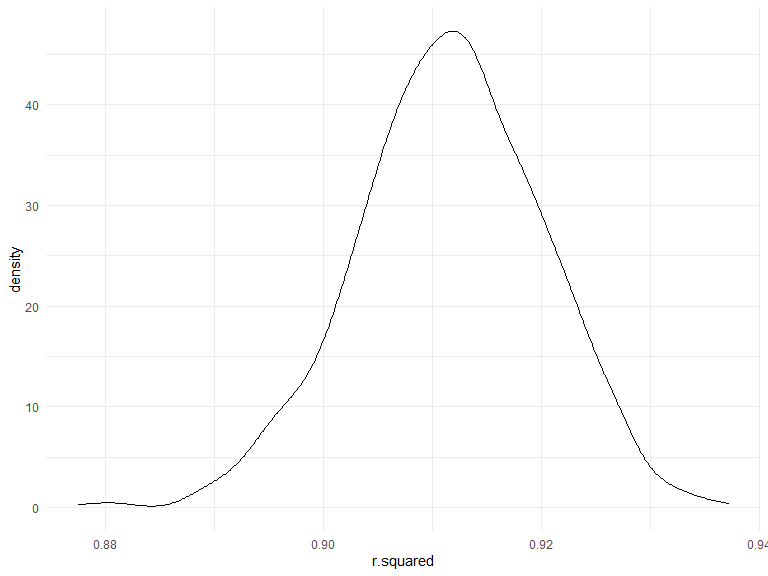
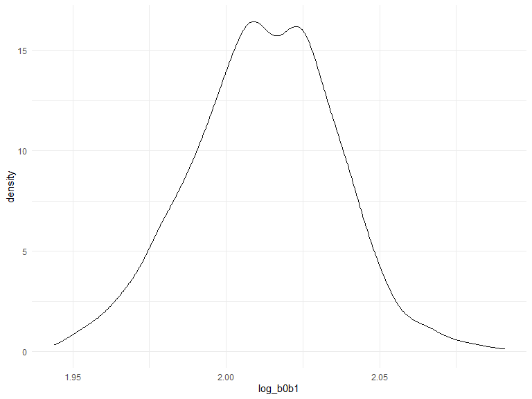
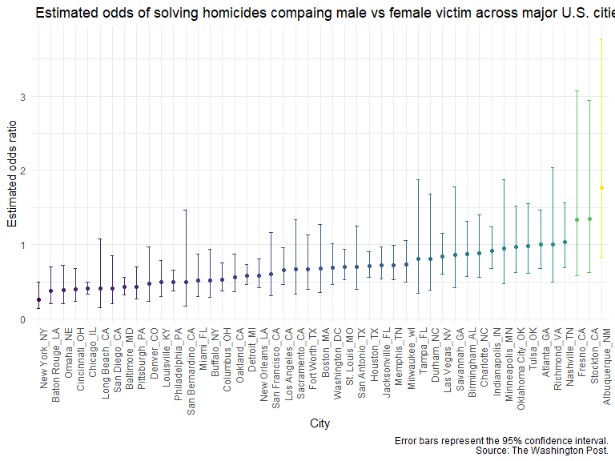

hw6
================

### Problem 1:

To obtain a distribution for $\hat{r}^2$, we’ll follow basically the
same procedure we used for regression coefficients: draw bootstrap
samples; the a model to each; extract the value I’m concerned with; and
summarize. Here, we’ll use `modelr::bootstrap` to draw the samples and
`broom::glance` to produce `r.squared` values.

``` r
weather_df = 
  rnoaa::meteo_pull_monitors(
    c("USW00094728"),
    var = c("PRCP", "TMIN", "TMAX"), 
    date_min = "2017-01-01",
    date_max = "2017-12-31") %>%
  mutate(
    name = recode(id, USW00094728 = "CentralPark_NY"),
    tmin = tmin / 10,
    tmax = tmax / 10) %>%
  select(name, id, everything())
```

``` r
weather_df %>% 
  modelr::bootstrap(n = 1000) %>% 
  mutate(
    models = map(strap, ~lm(tmax ~ tmin, data = .x) ),
    results = map(models, broom::glance)) %>% 
  select(-strap, -models) %>% 
  unnest(results) %>% 
  ggplot(aes(x = r.squared)) + geom_density()
```



In this example, the $\hat{r}^2$ value is high, and the upper bound at 1
may be a cause for the generally skewed shape of the distribution. If we
wanted to construct a confidence interval for $R^2$, we could take the
2.5% and 97.5% quantiles of the estimates across bootstrap samples.
However, because the shape isn’t symmetric, using the mean +/- 1.96
times the standard error probably wouldn’t work well.

We can produce a distribution for $\log(\beta_0 * \beta1)$ using a
similar approach, with a bit more wrangling before we make our plot.

``` r
weather_df %>% 
  modelr::bootstrap(n = 1000) %>% 
  mutate(
    models = map(strap, ~lm(tmax ~ tmin, data = .x) ),
    results = map(models, broom::tidy)) %>% 
  select(-strap, -models) %>% 
  unnest(results) %>% 
  select(id = `.id`, term, estimate) %>% 
  pivot_wider(
    names_from = term, 
    values_from = estimate) %>% 
  rename(beta0 = `(Intercept)`, beta1 = tmin) %>% 
  mutate(log_b0b1 = log(beta0 * beta1)) %>% 
  ggplot(aes(x = log_b0b1)) + geom_density()
```



As with $r^2$, this distribution is somewhat skewed and has some
outliers.

The point of this is not to say you should always use the bootstrap –
it’s possible to establish “large sample” distributions for strange
parameters / values / summaries in a lot of cases, and those are great
to have. But it is helpful to know that there’s a way to do inference
even in tough cases.

### Problem 2:

Importing the raw homicides dataset:

``` r
library (readr)

urlfile="https://raw.githubusercontent.com/washingtonpost/data-homicides/master/homicide-data.csv"

homicide_raw <-read_csv(url(urlfile)) %>% 
  janitor::clean_names()
```

``` r
homicide = homicide_raw %>%
unite('city_state',"city":"state", remove = FALSE)%>%
  select(-city,-state)%>%
   mutate (resolved = case_when (disposition == "Closed without arrest" ~ "unresolved", 
                                  disposition == "Open/No arrest" ~ "unresolved", 
                                  disposition == "Closed by arrest" ~ "resolved"),
           resolved = as.factor(resolved),
           resolved = fct_relevel(resolved, "unresolved"),
           victim_age = as.numeric(victim_age)) %>%
    filter(!(city_state %in% c("Dallas_TX" , "Phoenix_AZ","Kansas City_MO",  "Tulsa_AL"))) %>% 
     filter(victim_race == "White" | victim_race == "Black")
```

``` r
baltimore = homicide %>%
  filter(city_state == "Baltimore_MD")

balt_OR = baltimore %>% 
  glm(resolved ~ victim_age+victim_race+victim_sex, data = ., family=binomial()) %>% 
  broom::tidy() %>% 
  mutate(OR = exp(estimate),
         L_95CI = exp(estimate - (1.96*std.error)),
         U_95CI = exp(estimate +(1.96*std.error))) %>% 
  filter(term== "victim_sexMale") %>% 
  select(OR, L_95CI, U_95CI)

knitr::kable(balt_OR)
```

|        OR |   L_95CI |    U_95CI |
|----------:|---------:|----------:|
| 0.4255117 | 0.324559 | 0.5578655 |

The estimate of the adjusted odds ratio for solving homicides comparing
male victims to female victims keeping all other variables fixed are
0.43 with a 95% CI (0.32, 0.56)

``` r
OR_city = homicide%>% 
  nest(data = -city_state) %>% 
  mutate(model_city = map(data, ~ glm(resolved ~ victim_age + victim_sex + victim_race, 
                                 data = ., family = "binomial")), 
         result = map(model_city, broom::tidy)) %>% 
  select(-data, -model_city) %>% 
  unnest(result) %>% 
  mutate(OR = exp(estimate),
         L_95ci = exp(estimate - 1.96*std.error),
         U_95ci = exp(estimate + 1.96*std.error)) %>% 
  filter(term == "victim_sexMale") %>% 
  select(city_state, OR, L_95ci, U_95ci)
```

``` r
plot_city = OR_city %>% 
  mutate(city_state = fct_reorder(city_state, OR)) %>% 
  ggplot(aes(x = city_state, y = OR, colour = OR)) + 
  geom_point() + 
  geom_errorbar(aes(ymin = L_95ci, ymax = U_95ci, width = .3)) + 
  theme(axis.text.x = element_text(angle = 90, hjust = 1), 
        legend.position = "none") + 
  labs(
    x = "City",
    y = "Estimated odds ratio",
    title = " Adjusted odds of solving homicides compaing male vs female victim across major U.S. cities, 2007-2017",
    caption = paste0(
          "Error bars represent the 95% confidence interval.",
          "\nSource: The Washington Post."))
plot_city
```



Based on the graph, it can be noted that across most cities the ORs are
less than 1. This suggests that there are decreased odds of resolving a
homicide when the victim is male vs. when the victim is female. This
odds are lowest for New York. For many cities the 95% CI fo the adjusted
OR crosses the null value of , which denotes a statistically
insignificant association between sex and solving homicides.The only
cities which have increased odds of solving a homicide when the victim
is male vs. when the victim is female are Albequerque, Stockton and
Fresno but their 95% CI crosses the null value of 1.

### Problem 3

``` r
birthweight = read_csv("./data/birthweight.csv") %>%
  janitor::clean_names() %>% 
  mutate(bwt = bwt/453.59) %>% 
    mutate(
   babysex = recode(babysex, `1` = "male", `2` = "female"),
    babysex = factor(babysex)
)
```

For tidying the dataset, I converted birthweight of the baby from grams
to pounds to maintain consistency in measuring weight between variables
bwt (birthweight of baby) and delwt (mother’s weight at delivery). I
also converted babysex to a factor variable.
